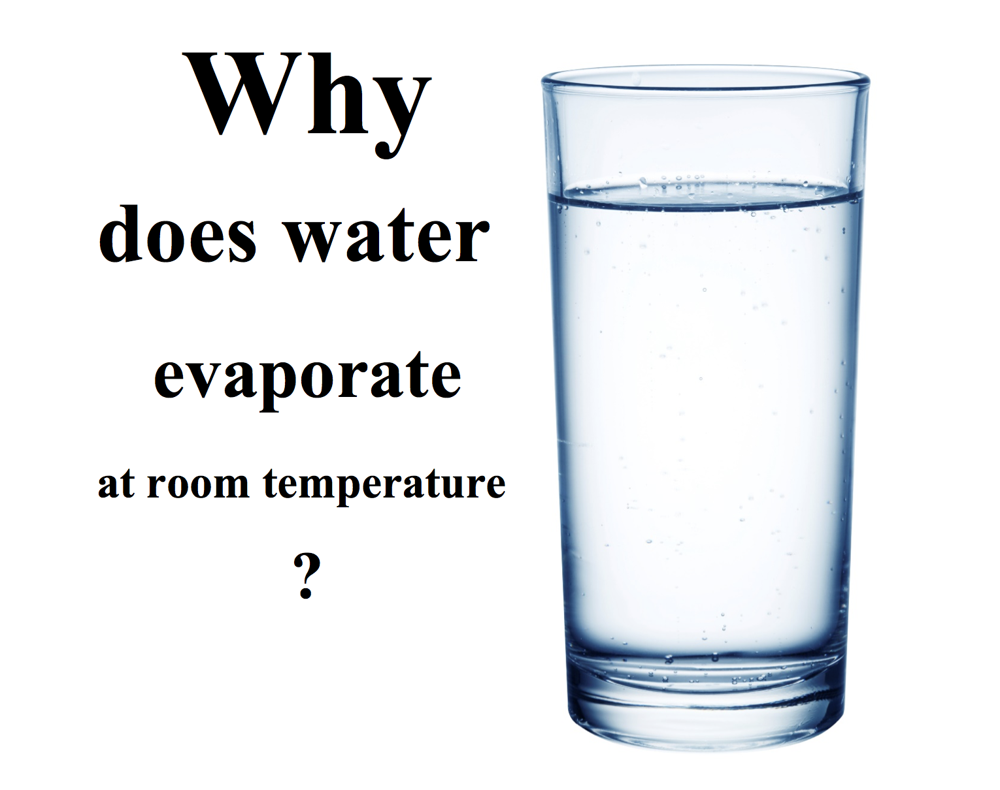
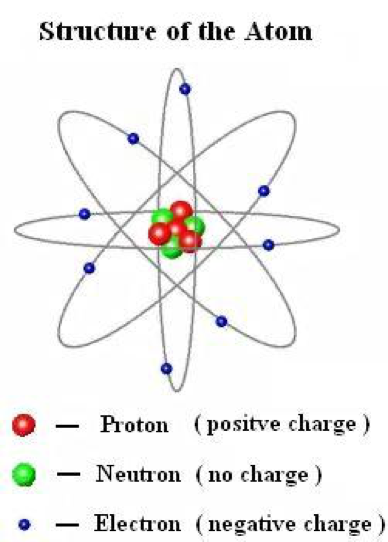
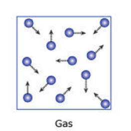
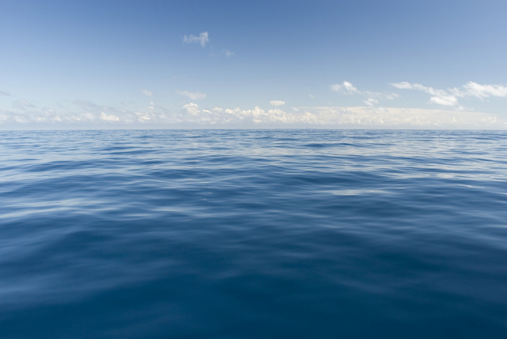
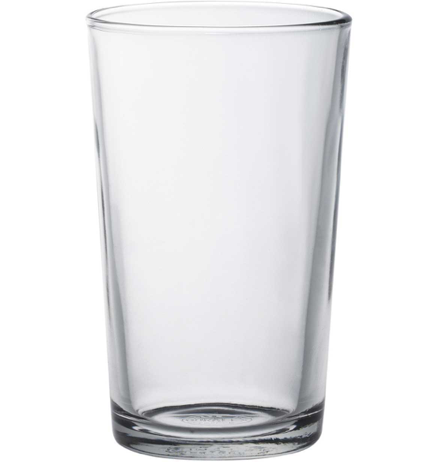

### We’ve all tried pouring up a glass of water, and not drinking all of it, but then the next day the glass is empty anyway. When you think about it, that is actually a pretty cool magic trick – the water disappears into thin air! Or maybe that’s just me…

In fact, it’s vital that liquid water can “disappear into thin air” because 97% of all water on earth is stored in the oceans and the rest would quickly trickle back into the oceans if it weren’t for this property and then all the land surface would turn into one big desert and we would all die.

So yeah, this ability of “disappearing into thin air” is not unique to water (all liquids can do it) and it’s called evaporation. Evaporation is one of two ways vaporization can happen. Vaporization is the phase transition from liquid to gas.

To fully understand evaporation, we need to first take a look at the atom. As you probably know, pretty much all matter in the universe is built of atoms. Atoms are built of negatively charged electrons clouding around a nucleus of positively charged protons and neutral neutrons.

So yeah, atoms contain charged particles. The deal with charge is that when something has a charge it experiences a force (push) when it’s near to other charged things. Like charges repel and unlike attract. This force between charged things is called electromagnetic force, and it’s how atoms can stick together, because atoms contain charged things.

So for example. a bunch of atoms could use their charge to stick to one another and form a molecule. The bonds in a molecule are called covalent bonds and basically work with the atoms sharing their electrons.

There are two scales on which electromagnetic forces stick molecules together. Firstly, there are the intramolecular forces, which are the forces holding the internal structure of a molecule in place. Secondly, there are the intermolecular forces acting between neighboring molecules. The intermolecular forces are very weak compared to the intramolecular forces.

The following segment is a simple description of how the intermolecular forces act in the three states of matter. Our example will be for a material made of molecules. There are different materials like metals where it works different.
When a substance of molecules is in the solid state the inter-molecular forces are strong enough to hold the molecules arranged in strict order, where all the identical molecules are holding in place by affecting each other with their electromagnetic force.

But then heat comes along. Heat, is basically just the particles of the substance shaking unorderly. This is valid for all materials - the average kinetic energy of particles rises proportionally with temperature. This shaking is a problem for the intermolecular forces because they are weak. As the shaking gets wilder the intermolecular forces have a tougher and tougher time holding the molecules arranged until they aren’t strong enough and the substance transitions to the liquid phase.

In the liquid phase the molecules move around each other, but they still feel the attractions and repulsion of the intermolecular forces between them, but when even more thermal energy (shaking) is added, the intermolecular forces become so weak compared to the movement of the molecules that the molecules start moving around freely effectively unaffected by the intermolecular forces.

Understanding intermolecular forces and how significant they are in the different phases was the foundation for understanding evaporation.

Here is the ocean.

Calm and idyllic. The water molecules must be relaxin’ just havin’ a good time – it is well below the boiling point of water, but still lots of water vapor is disappearing from the ocean like from the glass of water. Why is it that liquid water evaporates at room temperature?
As long as the temperature is above absolute zero (−273.15°C) the water molecules are vibrating and whizzing around. The average kinetic energy of all the molecules in the water isn’t strong enough to overcome the liquid phase intermolecular forces, but the energy levels of the particles vary. This means that a fraction of the molecules in the water have enough energy to escape the intermolecular forces. A fraction of this fraction of water molecules are near the surface and can launch themselves up into the air as vapor. So that’s how the water can evaporate at room temperature.

Evaporation has the effect that the liquid is cooled, because the molecules with the most thermal energy are escaping the liquid water and thereby leaving behind liquid with a lesser amount of thermal energy. This effect is called evaporative cooling, and it is also how sweating cools the human body.
But as you can see on the drawing above, water molecules from the vapor in the air are also going the other way. These are the molecules who don’t quite have the energy required to resist the intermolecular forces at the surface of the liquid. This causes the opposite of evaporative cooling because molecules with almost enough energy to be vapor are returning into the liquid, increasing the average thermal energy. So escaping particles cause evaporative cooling and the returning particles causes the opposite. If the evaporation happens in a closed container the density and pressure of the vapor above the liquid increases as molecules escape the surface. This also increases the rate of returning molecules. When the point is reached where evaporative cooling and its counterpart are removing and supplying the same amount of energy the evaporation has reached an equilibrium.
When the water particles returning from the air is supplying the same amount of thermal energy as the molecules escaping are removing, it’s called that the air is “saturated”. Saturation of the air, is the requirement for an evaporative equilibrium. Evaporative equilibrium is rarely achieved in the air above the ocean because the concentration of water molecules is constantly being reset as the water vapor floats upwards because its density is lower than the atmosphere around it. This means that the net transfer of water caused by evaporation from the oceans is almost always to the air and the same goes for the glass of water.

The glass is 0% full - not 100% empty…

-	Peter Bech Svalgaard, Quaqsi
